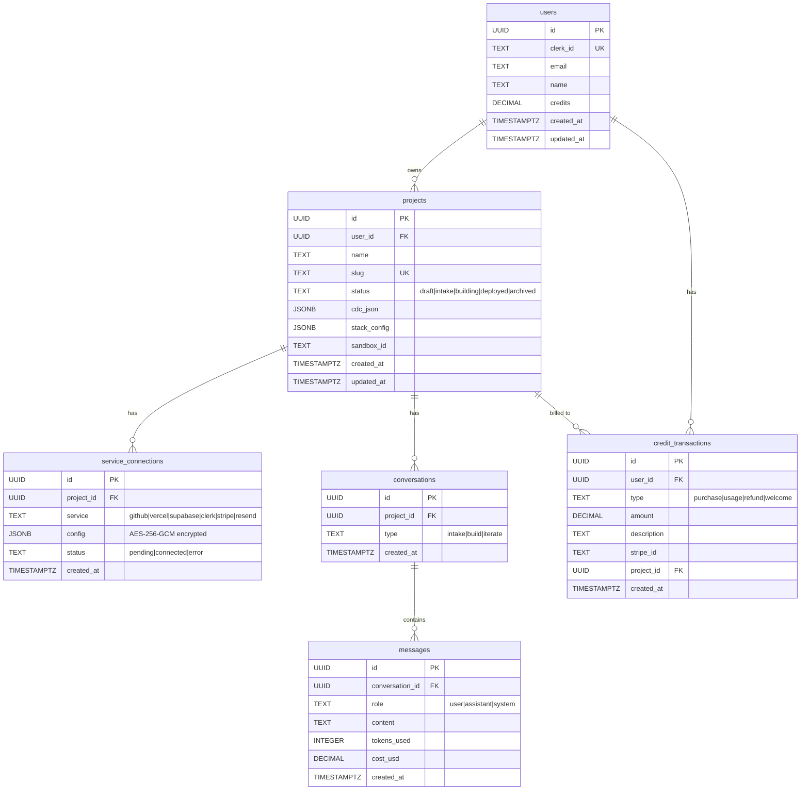
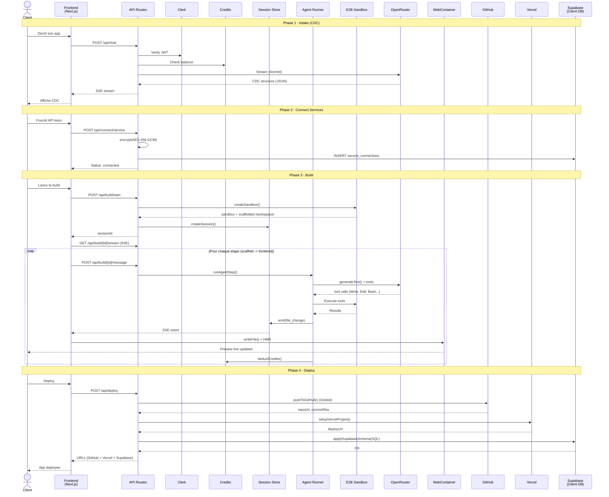

# Architecture FYREN Platform — Diagrammes Mermaid

**Projet** : FYREN Platform
**Date** : 22 mars 2026
**Usage** : Read-only, compréhension de l'architecture existante
**Rendu** : Coller dans un viewer Mermaid (GitHub, VS Code extension, mermaid.live)

---

## 1. Composants — Architecture des modules

> Vue d'ensemble : pages, composants, API routes, server modules, lib et leurs dépendances.

```mermaid
flowchart TB
    subgraph "Pages - App Router"
        LP["/ Landing"]
        SI["(auth)/sign-in"]
        SU["(auth)/sign-up"]
        DASH["(dashboard)/app"]
        NEW["(dashboard)/app/new"]
        BILL["(dashboard)/app/billing"]
        SET["(dashboard)/app/settings"]
        WS["(dashboard)/app/project/[id]"]
    end

    subgraph "Components"
        direction TB
        LAND["landing/landing-page"]
        ANIM["landing/animated-counter\ncode-rain\npreview-mockup\ntyping-code"]
        DC["dashboard/dashboard-content"]
        WL["workspace/workspace-layout"]
        CP["workspace/chat-panel"]
        WH["workspace/workspace-header"]
        DD["workspace/deploy-dialog"]
        PP["preview/preview-panel"]
        FT["preview/file-tree"]
        WCM["preview/webcontainer-manager"]
        UI["ui/ shadcn\nbutton, card, dialog,\ninput, tabs, skeleton..."]
    end

    subgraph "API Routes"
        CHAT["/api/chat"]
        PROJ["/api/projects"]
        CONN["/api/connect/*"]
        BUILD["/api/build/*"]
        DEPLOY["/api/deploy"]
        BILLING["/api/billing/*"]
        WH_CLERK["/api/webhooks/clerk"]
        WH_STRIPE["/api/webhooks/stripe"]
    end

    subgraph "Server"
        AR["agent/agent-runner"]
        SS["agent/session-store"]
        SM["agent/sandbox-manager"]
        AT["agent/tools"]
        PR["agent/prompts"]
        BP["build-pipeline"]
        DP["deploy/index"]
        DG["deploy/github"]
        DV["deploy/vercel"]
        DS["deploy/supabase"]
    end

    subgraph "Lib"
        SUPA["supabase"]
        CRYP["crypto"]
        CRED["credits"]
        RL["rate-limit"]
        UT["utils"]
    end

    subgraph "Types"
        TY["types/index"]
        TDB["types/database"]
    end

    LP --> LAND --> ANIM
    DASH --> DC
    WS --> WL
    WL --> CP & PP & FT & DD & WH
    PP --> WCM
    CP --> UI
    PP --> UI

    BUILD --> AR & SS & SM
    AR --> AT & SS & PR
    AT --> SM
    BUILD --> BP
    DEPLOY --> DP --> DG & DV & DS

    CHAT --> SUPA & CRED & RL
    PROJ --> SUPA & CRED & RL
    CONN --> CRYP & SUPA & RL
    BUILD --> CRED & RL
    BILLING --> SUPA & CRED & RL

    AR --> CRED & SUPA & UT
    DP --> SUPA & UT
    DG --> CRYP
    DV --> CRYP
    DS --> CRYP
```

---

## 2. Base de données — Schema ER

> Tables Supabase (Postgres), relations et RLS. Les API keys dans `service_connections.config` sont chiffrées AES-256-GCM.

---

## 3. Data Flow — Parcours d'un build complet

> Sequence diagram : de l'intake conversationnel au deploy sur l'infra du client.

---

## Patterns architecturaux cles

| Pattern | Implementation |
|---|---|
| **Event-Driven Streaming** | Agent emits events via EventEmitter -> Frontend subscribe via SSE |
| **Sandbox isole** | Chaque build = 1 Firecracker microVM E2B avec Next.js scaffold |
| **Secrets chiffres** | API keys AES-256-GCM avant stockage, decrypt in-memory au deploy |
| **RLS-First** | Toutes les tables Supabase avec Row Level Security + Clerk JWT |
| **Credit metering** | OpenRouter cost x3 = FYREN credits, deduction atomique via RPC Postgres |
| **Multi-stage pipeline** | 8 etapes avec modele LLM, tools et skills specifiques par etape |
| **Zero lock-in** | Code genere sans dependance FYREN, push sur GitHub client |
| **Rate limiting** | In-memory per-user/per-action (TODO: Redis pour multi-instance) |
